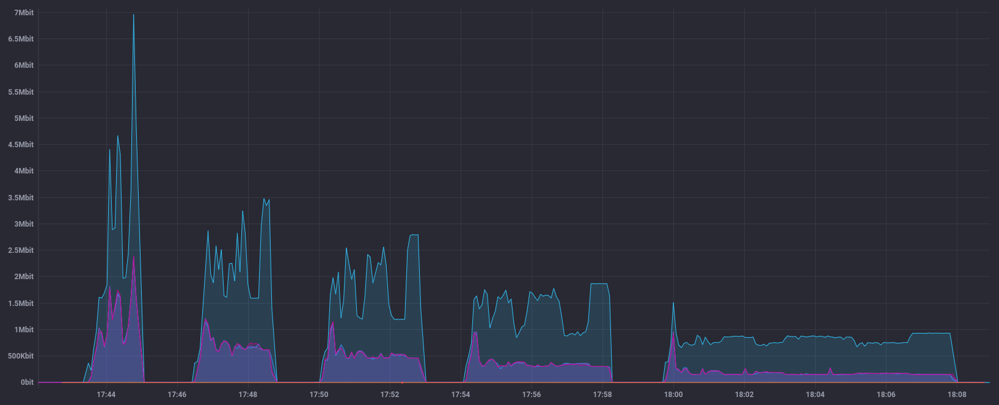

### docker-spark集群的流量采集与控制

由gettyimages/spark构建的spark docker集群，由1个master与3个worker组成。图为该集群每30s运行一次javaTC任务时的流量折线图，蓝色为master。监控程序汇总每秒各个节点的入(?)流量并上报。

在运行javaTC任务时对master节点进行tc流量控制后的折线图。五次任务的tc设置及耗时分别为：
* 无设置 1.3min
* rate 16Mbit burst 9999Kb lat 10.0s 2.2 min
* rate 12Mbit burst 9999Kb lat 10.0s  2.9 min
* rate 8Mbit burst 9999Kb lat 10.0s   4.1 min
* rate 4Mbit burst 9999Kb lat 10.0s   8.2 min